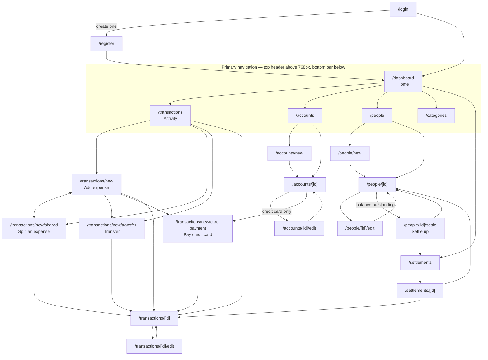

# Expense Tracker — UI screenshots for design

Full-page screenshots of every screen in the app, captured from the real running build.

**This set is the "Ledger Geometry" restyle, recaptured after task groups 21–41.** The previous
set was the pre-restyle app and is what the redesign was drawn against; this one is the result,
sent back for sign-off. What changed, and what still needs a decision, is in section 5.

Nothing here is a mockup or an illustration. Every number, label and empty state is what the
application actually renders.

---

## 1. What is in here

```text
design/screenshots/
  README.md          this file
  desktop/           53 PNGs — 1440 x 900, light
  mobile/            55 PNGs — 402 x 874 (iPhone 16 Pro) at 3x, light
  desktop-dark/      18 PNGs — the same, dark
  mobile-dark/       19 PNGs — the same, dark
```

The two light folders hold the **same 53 screens under the same filenames**, so
`desktop/19-dashboard.png` and `mobile/19-dashboard.png` are one screen at two widths. Two shots
are mobile-only: `53-install-prompt`, because it is the one piece of interface the platform
decides rather than the app, and `54-quick-add-expanded`, because the quick-add button does not
exist above the breakpoint.

**This set was recaptured after the navigation work, task groups 42-48.** One screen is new —
`55-expense-edit-settled`, the "Cannot edit" guard — and it is the only screen in the app that had
never been photographed. Every other file is the same screen as before with a back link added above
its title. What changed is in section 5.

The app has a single breakpoint that changes layout — Chakra's `md`, 48rem / 768px — so the
desktop set is "above the breakpoint" and the mobile set is "below" it. There is nothing in
between.

**Dark mode is a subset, not a duplicate.** Eighteen screens, chosen so that between them they
render every semantic colour the theme defines: all five swatch fills, both amount directions,
every status badge that appears in seeded data, the accent tint, the sunken inset, an alert, the
`BALANCED` stamp, an empty state, a field in its error state, and the offset shadows on both a
card and a button. Photographing all 54 twice more would have produced a hundred extra images to
review for a palette flip.

|                    | Desktop                 | Mobile                  |
| ------------------ | ----------------------- | ----------------------- |
| Viewport           | 1440 x 900              | 402 x 874               |
| Device pixel ratio | 1                       | 3                       |
| Navigation         | links in the top header | fixed bar at the bottom |
| Locale / timezone  | en-IN, Asia/Kolkata     | en-IN, Asia/Kolkata     |
| Colour scheme      | light, and dark         | light, and dark         |

---

## 2. Naming

```text
NN-screen-name[-state].png
```

`NN` is reading order, not a route. The numbers run in the order a person meets these
screens: signing in, then a brand-new account with nothing in it, then an account with data,
then the system states.

The suffix says which version of the screen it is:

- no suffix — the ordinary case
- `-empty` — no data yet
- `-validation-errors` — after a failed submit
- `-needs-<thing>` — a form refusing to appear because a prerequisite record is missing
- anything else (`-bank`, `-credit-card`, `-owes-you`, `-you-owe`, `-settled`) — the same
  screen driven by a different record

---

## 3. Index

### Getting in

| File                            | Route       | What it shows                                                                                                                                                                 |
| ------------------------------- | ----------- | ----------------------------------------------------------------------------------------------------------------------------------------------------------------------------- |
| `01-login`                      | `/login`    | Sign in. Email, password, link to sign-up. No social sign-in and no password reset.                                                                                           |
| `02-login-invalid-credentials`  | `/login`    | Wrong password. One error banner above the form; the fields are not individually marked, deliberately — saying which half was wrong would confirm whether the address exists. |
| `03-register`                   | `/register` | Sign-up. Name, email, password, confirm, currency, timezone. Currency and timezone are asked for here because every later amount and every monthly total depend on them.      |
| `04-register-validation-errors` | `/register` | Three failure kinds in one image: a malformed email, a password under the 10-character minimum, and a confirm-password mismatch — the cross-field case.                       |

### First run — a brand-new account with nothing in it

All of this is reachable before any data exists, and all of it is what a new user meets
first.

| File                                 | Route                            | What it shows                                                                                                                                                                                                                   |
| ------------------------------------ | -------------------------------- | ------------------------------------------------------------------------------------------------------------------------------------------------------------------------------------------------------------------------------- |
| `05-dashboard-empty`                 | `/dashboard`                     | The dashboard with nothing to summarise: quick actions and a prompt to record a first expense.                                                                                                                                  |
| `06-accounts-empty`                  | `/accounts`                      | No accounts. The totals card is hidden entirely rather than showing zeroes.                                                                                                                                                     |
| `07-account-new`                     | `/accounts/new`                  | Add an account, defaulting to Bank. Type is a native select: Bank / Cash / Credit card.                                                                                                                                         |
| `08-account-new-credit-card`         | `/accounts/new`                  | The same form with Credit card chosen. A fieldset appears that exists nowhere else — credit limit, statement day, payment due day — and the balance field changes meaning from "opening balance" to "current outstanding".      |
| `09-account-new-validation-errors`   | `/accounts/new`                  | A missing name and an unparseable opening balance. Field-level messages sit under each control.                                                                                                                                 |
| `10-people-empty`                    | `/people`                        | No people.                                                                                                                                                                                                                      |
| `11-person-new`                      | `/people/new`                    | Add a person. Name and notes only — a person here is a contact, not a user of the app.                                                                                                                                          |
| `12-categories-defaults`             | `/categories`                    | **Not** an empty state. Registration seeds nine top-level categories — Food, Transport, Shopping, Bills, Entertainment, Health, Travel, Rent, Other — so this screen is never blank. They are ordinary, renameable, archivable. |
| `13-activity-empty`                  | `/transactions`                  | No transactions. Search and the filter panel are still present above the empty state.                                                                                                                                           |
| `14-expense-new-needs-account`       | `/transactions/new`              | The expense form refusing to appear because there is no account to pay from.                                                                                                                                                    |
| `15-split-new-needs-person`          | `/transactions/new/shared`       | Same idea: a split needs at least one other person.                                                                                                                                                                             |
| `16-transfer-new-needs-accounts`     | `/transactions/new/transfer`     | A transfer needs two accounts, and the destination cannot be a card.                                                                                                                                                            |
| `17-card-payment-new-needs-accounts` | `/transactions/new/card-payment` | A card payment needs a card, and something that is not a card to pay it from.                                                                                                                                                   |
| `18-settlements-empty`               | `/settlements`                   | No settlements.                                                                                                                                                                                                                 |

> Those four `-needs-` screens deserve attention. Between them they are the most common first
> experience in the app. The navigation work gave each one a named action to the record it asks
> for — "Add an account", "Add a person" — plus a back link, since a guard replaces the form and
> therefore has no Cancel. They are still a warning block rather than a guided first-run flow,
> which is a design question rather than a navigation defect.

### Everyday use — an account with realistic data

Seeded with three accounts (bank, cash, credit card), the nine default categories plus six
sub-categories, three people, seven personal expenses, three shared expenses, a transfer, a
card payment, and one settlement recorded through the real form. Amounts are INR.

| File                               | Route                            | What it shows                                                                                                                                                                                                                                                                                            |
| ---------------------------------- | -------------------------------- | -------------------------------------------------------------------------------------------------------------------------------------------------------------------------------------------------------------------------------------------------------------------------------------------------------- |
| `19-dashboard`                     | `/dashboard`                     | The full dashboard: summary tiles, net position, the month's spending broken down by category, account balances, who owes whom in both directions, recent activity, recent settlements. The longest page in the app.                                                                                     |
| `20-accounts`                      | `/accounts`                      | Totals card (bank + cash, card outstanding, available credit, net position) then the account list.                                                                                                                                                                                                       |
| `21-account-detail-bank`           | `/accounts/[id]`                 | A bank account: balance, opening balance, currency, a link to its transactions, archive control.                                                                                                                                                                                                         |
| `22-account-detail-credit-card`    | `/accounts/[id]`                 | The same page for a credit card — a different set of rows (outstanding, limit, available credit, statement day, due day) and a "Pay card" action.                                                                                                                                                        |
| `23-account-edit`                  | `/accounts/[id]/edit`            | Edit an account. Type is read-only, because changing it would reinterpret every amount already recorded against the account.                                                                                                                                                                             |
| `24-people`                        | `/people`                        | Totals, then each person with initials, net balance, and an explicit direction: "owes you", "you owe", or "Settled up". Never a bare amount.                                                                                                                                                             |
| `25-person-detail-owes-you`        | `/people/[id]`                   | Someone who owes money: balance card with direction badge, unsettled expenses, settlement history, archive control.                                                                                                                                                                                      |
| `26-person-detail-you-owe`         | `/people/[id]`                   | The other direction, arising from an expense that person paid for.                                                                                                                                                                                                                                       |
| `27-person-detail-settled`         | `/people/[id]`                   | Square with them. The settled-expenses card and a populated settlement history appear only in this state.                                                                                                                                                                                                |
| `28-person-edit`                   | `/people/[id]/edit`              | Edit a person.                                                                                                                                                                                                                                                                                           |
| `29-categories`                    | `/categories`                    | The category tree with sub-categories added. Nesting is capped at one level; children are indented rather than shown in a tree control. Edit and Archive per row.                                                                                                                                        |
| `30-categories-add-form`           | `/categories`                    | The add form. It is **inline**, not a modal and not a separate page.                                                                                                                                                                                                                                     |
| `31-categories-edit-row`           | `/categories`                    | A row switched into edit mode in place.                                                                                                                                                                                                                                                                  |
| `32-activity`                      | `/transactions`                  | History grouped by date, with search, a collapsed filter panel, type badges (Split / Transfer / Card payment) and settlement badges (Settled / Part settled). Loads more on scroll.                                                                                                                      |
| `33-activity-filtered`             | `/transactions?…`                | The same list with type, account and personal/shared filters applied.                                                                                                                                                                                                                                    |
| `34-expense-new`                   | `/transactions/new`              | The core flow and the most-used screen in the app: amount, description, account, category, date, notes. Amount is first and autofocused.                                                                                                                                                                 |
| `35-expense-new-validation-errors` | `/transactions/new`              | Submitted untouched. Account and date carry defaults, so only amount and description fail.                                                                                                                                                                                                               |
| `36-expense-detail-personal`       | `/transactions/[id]`             | A personal expense.                                                                                                                                                                                                                                                                                      |
| `37-expense-edit`                  | `/transactions/[id]/edit`        | Edit an expense.                                                                                                                                                                                                                                                                                         |
| `38-split-new`                     | `/transactions/new/shared`       | Split an expense, untouched. Note how little the split editor shows before an amount is entered.                                                                                                                                                                                                         |
| `39-split-new-equal-split`         | `/transactions/new/shared`       | The same form with ₹4,800 split equally three ways. The app's most involved control: payer select, split method, one row per participant with their computed share, and a running allocated total. Choosing a person as payer hides the account picker entirely, because no account of the user's moved. |
| `40-split-new-validation-errors`   | `/transactions/new/shared`       | Submitted empty.                                                                                                                                                                                                                                                                                         |
| `41-expense-detail-shared`         | `/transactions/[id]`             | A shared expense: each participant's share and its settlement status. The amount paid and the user's own share are separate figures here, and must stay separate.                                                                                                                                        |
| `42-transfer-new`                  | `/transactions/new/transfer`     | Move money between your own accounts. Credit cards are excluded from the destination list, because paying a card is a different kind of record.                                                                                                                                                          |
| `43-transfer-detail`               | `/transactions/[id]`             | A transfer. Visually distinct from an expense — it has a direction and no participants.                                                                                                                                                                                                                  |
| `44-card-payment-new`              | `/transactions/new/card-payment` | Pay a card, arrived at from the card itself so the card is pre-selected. Includes a "Pay full balance" shortcut.                                                                                                                                                                                         |
| `45-card-payment-detail`           | `/transactions/[id]`             | A card payment.                                                                                                                                                                                                                                                                                          |
| `46-settle-up`                     | `/people/[id]/settle`            | The most intricate screen in the app. A payment amount, then one editable line per outstanding expense, pre-spread oldest-first, with a running allocated total.                                                                                                                                         |
| `47-settle-up-unbalanced`          | `/people/[id]/settle`            | The same form with one allocation edited so the lines no longer add up to the payment. Warning shown, submit disabled.                                                                                                                                                                                   |
| `48-settlements`                   | `/settlements`                   | Every recorded settlement.                                                                                                                                                                                                                                                                               |
| `49-settlement-detail`             | `/settlements/[id]`              | One settlement, and which specific expenses it settled.                                                                                                                                                                                                                                                  |

### System states

| File                      | Route                         | What it shows                                                                                                                                                                                                                                                                                                                                                                                                                                                                                                                                                                                                       |
| ------------------------- | ----------------------------- | ------------------------------------------------------------------------------------------------------------------------------------------------------------------------------------------------------------------------------------------------------------------------------------------------------------------------------------------------------------------------------------------------------------------------------------------------------------------------------------------------------------------------------------------------------------------------------------------------------------------- |
| `50-not-found-page`       | any unknown URL               | 404 with no application chrome.                                                                                                                                                                                                                                                                                                                                                                                                                                                                                                                                                                                     |
| `51-not-found-record`     | a record that does not exist  | 404 **inside** the app shell, so navigation stays available. This is the one people actually hit: opening a link to something deleted on another device.                                                                                                                                                                                                                                                                                                                                                                                                                                                            |
| `52-offline`              | `/offline`                    | Served by the service worker when a navigation fails and nothing is cached for that URL.                                                                                                                                                                                                                                                                                                                                                                                                                                                                                                                            |
| `53-install-prompt`       | any page, **mobile only**     | The "add to home screen" invitation, in the app shell above the page content. On iOS there is no programmatic install, so it can only describe Safari's Share menu. It is dismissible and remembered, and it is suppressed in the other mobile screenshots — otherwise it would occupy the top of every one of them.                                                                                                                                                                                                                                                                                                |
| `54-quick-add-expanded`   | `/dashboard`, **mobile only** | The quick-add layer, open, against `Mobile-QuickAdd-Expanded.html`. Four actions stacked outward from the button, "Add expense" nearest the thumb. Captured **viewport-only**: the scrim is `position: fixed`, so a full-page image would show one screen dimmed and the rest not, which is not a state the app can be in. The tab bar is dimmed too — measured, the scrim sits above it at z-index 1300 against the bar's 1100.                                                                                                                                                                                    |
| `55-expense-edit-settled` | `/transactions/[id]/edit`     | **New in this set.** The edit form refusing to open because the expense has been settled — changing it would leave a settlement pointing at a share that no longer exists. Reached by tapping Edit on a settled shared expense, and previously the worst screen in the app: a title, a warning paragraph, and nothing else. No Cancel, because the form never renders. It now links each blocking settlement and the expense itself, and carries a back link. It does **not** offer to remove the settlement — that belongs on the settlement's own page, where its amount and the expenses it cleared are visible. |

---

## 4. Screen flow



Three things in that graph are easy to miss:

1. **Every create form ends on the detail page of the thing it created.** There is no
   "saved — now what" screen. Since the navigation work there _is_ a way back to the list: every
   detail page carries a back link above its title.
2. **`/settlements` is still not in the tab bar**, by decision rather than oversight — a sixth tab
   costs every label about 17% of its width at 402px, which is the crushed-label bug the restyle
   closed twice. It is now reachable three ways instead of one: the dashboard's "See all", a
   "Settlement history" link on `/people`, and a back link from any settlement's own page. Before
   the navigation work its detail page could not reach its list at all.
3. **On a phone, adding anything is now one tap from anywhere.** The floating quick-add button
   in the bottom-right corner of every authenticated screen opens the four-action layer in
   `54-quick-add-expanded`. Above the breakpoint there is no button and the dashboard's quick
   actions are still the route. This is the `+` the original UX spec asked for
   (`docs/04-USER-FLOWS.md` section 2), and it arrived with the restyle.

---

## 5. Worth knowing before redesigning

**One breakpoint, two themes.** Layout changes at 768px and nowhere else. Dark mode shipped with
the restyle: a sun/moon toggle in the header, remembered in `localStorage`, falling back to the
operating system's preference on a first visit and applied by a blocking inline script so there
is no flash of the wrong theme. The handoff drew two dark artboards; the other sixteen dark
screens in this set were derived from the dark colour table and **need review**.

**Native selects everywhere.** Every dropdown — account, category, payer, split method,
direction — is a real `<select>`, chosen so iOS shows its own picker and so the control needs
no accessibility work of its own. Replacing them with custom listboxes means taking that work
on.

**No modals or dialogs anywhere in the app.** Not one. Creating, editing and confirming all
happen inline or on a full page. `30-categories-add-form` and `31-categories-edit-row` are
the inline pattern.

**Amounts use tabular figures** so columns of numbers line up. Worth keeping.

**Every figure is derived, never stored.** Balances, card outstanding, who-owes-whom and
monthly totals are recalculated from the underlying records on each load. The restyle says this
out loud rather than hiding it: the dashboard carries an `AS OF <date, time>` line and the net
position a `COMPUTED` marker. Both mean "worked out just now", not "cached since then" — which is
the distinction to preserve if that wording ever changes.

**Three amounts must stay visibly distinct** on a shared expense: the total paid, the user's
own share, and what each other person owes. Collapsing them is the easiest way to make this
app wrong.

**Direction is always spelled out** in balances — "Arun owes you", "you owe Priya" — never a
bare signed number. Keep that.

### The two layout defects are fixed

Both bugs the previous set carried are gone, and both were verified by measuring the rendered
page rather than by looking at it.

**The clipped Cancel button.** The submit was `width: 100%` with Cancel beside it in the same
row, so the row overflowed and Cancel was cut off — at both widths, on every create and edit
form, which meant there had been no reachable Cancel anywhere in the app. A single `FormActions`
component now owns the row, with the submit at `flex: 1 1 0%` and Cancel at `flex-shrink: 0`, and
`onCancel` is a required prop so the row cannot be rendered without a way out. Measured on
`/transactions/new`:

```text
1440px   row 122 → 771    card 122 → 771    Cancel ends inside the card, full width
 393px   row  40 → 353    card  40 → 353    Cancel 248 → 353, full 105px, same row
```

Visible in `desktop/34-expense-new.png` and `mobile/34-expense-new.png`, and on every other form.

**The crushed mobile page title.** At 402px a title sharing a row with action buttons was left
around 150px wide and wrapped to one word per line. Three things fixed it: the header's sign-out
is now icon-only, the user's name is hidden below the breakpoint, and the page header stacks.
Measured at 393px: `flex-direction: column`, and "Add expense" renders at its full 26px on **one
line**. Compare `mobile/34-expense-new.png` and `mobile/32-activity.png` with the previous set.

Still open, and still a design decision rather than a fix: **the activity filter panel is
collapsed by default.** It now shows a count of active filters on the toggle, which is more than
it did, but `32-activity` and `33-activity-filtered` are still similar at a glance.

### Known gaps in the app

Missing, not mis-captured:

- **No settings screen.** The route folder exists and is empty. Currency, timezone and
  default account have nowhere to live; sign-out is a button in the header.
- **No reports or analytics screen.** The dashboard's monthly breakdown is the only
  reporting surface.
- **No income.** Expenses, transfers and card payments only.
- **Navigation still differs from the original UX spec**, though less than it did.
  `docs/04-USER-FLOWS.md` section 2 asks for a desktop sidebar including Reports and Settings,
  and a prominent `+` on mobile. The `+` now exists, as a floating button rather than in the
  centre of the bar; the desktop sidebar does not, and there is nothing to put in it until
  Reports and Settings exist.

### On-screen navigation, since groups 42-48

Worth knowing when reviewing this set, because it changes the top of almost every screen.

Before this work the app had **no back button, no breadcrumb, and no page that named its own
parent**. Fifteen of twenty-eight screens had no on-screen way back to where they came from, and
three could not be left at all except by the browser's own back button.

What is new in these captures:

- **A back link above the page title** on every child page — detail pages, create forms, edit
  forms. Mono uppercase in the same register as the "See all" card actions, with a left chevron:
  `‹ ACCOUNTS`, `‹ ACTIVITY`, or the record's own name on an edit form. Its accessible name is
  "Back to Accounts"; the visible text is the bare destination.
- **`/transactions`' back link says "Activity"**, matching the tab bar, not the path.
- **Named records are links.** The account, card and category on a transaction; the accounts on a
  transfer; the participants on a shared expense; the settlements in a person's history. All were
  plain text.
- **Cancel goes somewhere predictable.** It was `router.back()`, which did nothing useful on a
  shared link, after a refresh, or when the form was opened from the quick-add button — which is on
  every screen. It now goes to the form's parent.
- **The guard screens have an action** — see the note under the `-needs-` screens above.
- **`55-expense-edit-settled` is a new screen in this set.** It had no capture before.

Two things deliberately did **not** change, and both are decisions rather than omissions:
`/settlements` is not a sixth tab, and there is no breadcrumb anywhere. Both are argued in
`docs/navigation-tasks/updates/GROUP-42-NAVIGATION-DECISIONS.md`.

**What needs review here:** the back link's placement and treatment. It introduces no new token
and no new colour, but no artboard in `design/ux/screens/` draws a back affordance, so its position
above the title is this implementation's own choice. `chevron-left` is also newly drawn in-house,
bringing that list to fifteen.

- **`/settlements` is still not in the navigation.** Reachable from the dashboard and from the
  settle-up flow only.
- **Archived records** have a "Show archived" toggle on the accounts, people and categories
  screens, but that view is not in this set — the seed data has nothing archived. The archived
  treatment itself is built: a quiet `ARCHIVED` badge on a sunken row.
- **Loading and skeleton states** are not in this set either, and `docs/04-USER-FLOWS.md`
  section 24 asks for them. Nothing in the restyle addressed them.
- **Forced-colors / Windows High Contrast mode is unverified**, and it is the biggest open risk
  in the new design: the two devices this restyle leans on hardest are 2px borders and offset
  shadows, and that mode removes `box-shadow` entirely — which would take the focus indicator
  with it.

### Capture caveats

- These are **full-page** captures, except `54-quick-add-expanded`. The header is sticky and
  appears at the top, which is where it always is. Two things are `position: fixed` in the real
  app and are re-anchored for the capture, because a fixed element in a tall screenshot otherwise
  lands in the middle of the image on top of the content:
  - the **bottom bar** is made static, so it falls to the end of the page;
  - the **quick-add button** is moved to just above that bar, which is where it sits on a phone.

  So both are faithful in **appearance** and not in **behaviour** — on a real phone they stay on
  screen as you scroll.

- Hover, focus and pressed states are not captured. The keyboard focus state — a teal offset
  shadow on every interactive element — is verified by test rather than by screenshot
  (`tests/e2e/focus-visible.spec.ts`).
- The pages are photographed settled, with animations disabled and motion reduced.
- Native `<select>` controls are drawn by the host browser, which here is Chrome on Windows
  rather than the iOS wheel picker. On a real iPhone every dropdown in the mobile set opens
  the system picker.
- Dates are relative to the day of the run.

---

## 6. What needs your sign-off

Everything below is a decision taken in code because the handoff did not cover it, or a departure
from the handoff with a reason. Each one is recorded in full, with the reasoning, in
`docs/design-tasks/updates/`.

### Palette changes — three values are not the ones drawn

All three fail WCAG AA at the size and weight the handoff itself draws them at, so they had to
move; how far they moved is the judgement to confirm.

```text
tealText   #1D7A6C → #17685B    4.47:1 on the accent tint it sits on
coralText  #D1523F → #BA402E    4.21:1 on white at 14px / 600
mintText   #2E8A61 → #277650    4.26:1 on white at 14px / 600
```

Four more were darkened earlier for the same reason: `content.subtle`, `content.quiet`,
`content.meta`, and the dark palette's `darkInkMeta`.

### Sixteen dark screens that were never drawn

`Dashboard-Dark.html` and `Mobile-Dashboard-Dark.html` are the only dark artboards. Everything in
`desktop-dark/` and `mobile-dark/` other than `19-dashboard` was derived from the dark colour
table. The dark focus ring is derived too — the handoff draws no focused control on a dark screen.

### Forty screens that were never drawn

The coverage matrix in `docs/design-tasks/01-DESIGN-SYSTEM.md` section 10 lists twelve screens
with a design and forty without. The forty are compositions of drawn components, and none needed
a new visual idea, but they have not been reviewed. The ones to look at first, because they are
the least like anything drawn:

|                                                        | Why                                                                                                                               |
| ------------------------------------------------------ | --------------------------------------------------------------------------------------------------------------------------------- |
| `07`–`09`, `23` account forms; `11`, `28` person forms | the form card carries a side rail that only the add-expense artboard shows                                                        |
| `21`, `22` account detail                              | a detail list plus summary tiles, a combination that appears nowhere in the handoff                                               |
| `14`–`17` the prerequisite guards                      | the most common first experience in the app, and still a warning block rather than anything guided                                |
| `18`, `48`, `49` settlements                           | list and detail, built from the activity row                                                                                      |
| `29`–`31` categories                                   | the swatch tree, the inline forms, and the new **icon picker** — eighteen glyph tiles as a radio group, which is entirely undrawn |
| `03`, `04` sign-up                                     | `DESIGN.md` lists it as missing                                                                                                   |
| `42`–`45` transfer and card payment                    | `DESIGN.md` lists these as missing                                                                                                |
| `50`, `51` the two not-found pages                     | built on the empty state with a mono status eyebrow                                                                               |
| `41` shared expense detail                             | has to keep three amounts distinct and is undrawn                                                                                 |

### Specific things to look at

- **Fourteen of the glyphs are in-house.** The handoff names twenty-eight icons and the app needs
  forty-three; the missing ones were drawn to match the set's weight and terminals.
- **`calendar` is used only inside the icon picker.** The artboard draws a calendar glyph on the
  date field, and a native `<input type="date">` indicator cannot be replaced across browsers
  without giving up the platform date picker. That trade was taken in favour of the picker.
- **Card debt reads coral**, reversing an earlier decision that "anything owed is just a fact".
  Zero owed still reads as plain ink rather than coral.
- **The mobile quick-action row was removed from the dashboard.** `Mobile-Dashboard-Light.html`
  has none, and the quick-add button replaces it; shipping both would have put eight controls on
  screen for four destinations.
- **Badges stack below the text below `md`** in the activity, accounts, people and categories
  rows. A badge cannot shrink, and sharing the row crushed the description to one character.
- **The reference code appears once per screen, in the side rail** — not also as a page-header
  eyebrow, which is how the artboard draws it.
- **Terminology.** "Split a bill", "Split instead", "Split", "Pay card", "Card payment" — chosen
  once and used everywhere.

---

## 7. Regenerating

```bash
npm run screenshots                   # build, serve, capture everything
npm run screenshots -- --skip-build   # reuse the existing build, much faster
npm run screenshots -- --headed       # watch it run
```

The script is `scripts/capture-screenshots.ts`. It starts a throwaway in-memory MongoDB, builds
and serves the app on port 4400, registers two users, seeds one of them through the API, records
a settlement through the real form, and captures all four profiles. It **cannot** reach a real
database: the connection string is generated at the start of the run and discarded at the end.

All four output folders are wiped and rewritten each run, and the script exits non-zero if a
screen is missing from any of them or comes back suspiciously small.

The dark subset is the `DARK_SHOTS` list at the top of the script; adding a screen to it is a
one-line change.

The PNGs are not committed (see `.gitignore`); this README is.
